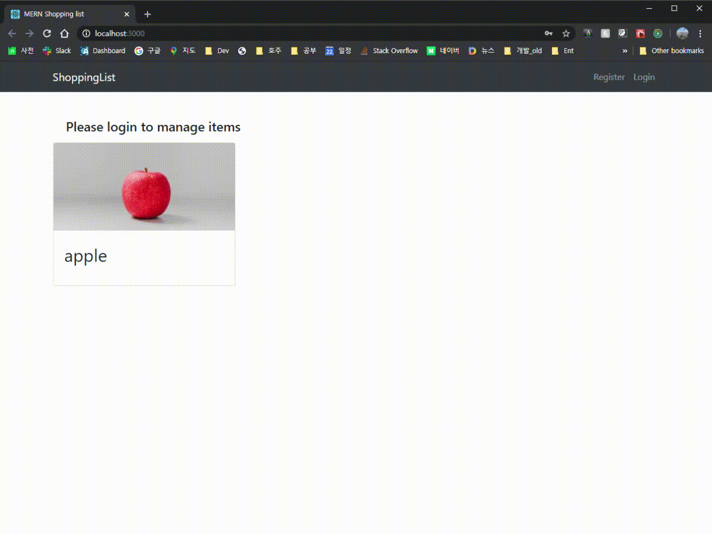

# mern_shopping_list

## Link
### Github link : https://github.com/jasonkim7288/mern_shopping_list
### Deploy link : https://jasonmernshoppinglist.herokuapp.com

## Description
MERN shopping list for tutorial and additional customized functions.
Additional function is whenever item is added, unsplash api will find a picture based on item's name and it will be displayed.

## Tech stack
- MERN : Front end and back end source code
- Heroku : deploy the code
- Unsplash : API for searching images
